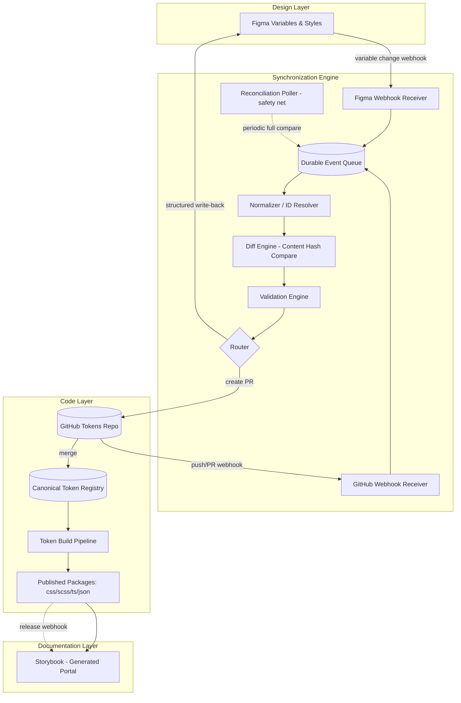
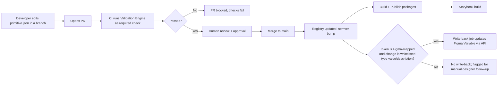
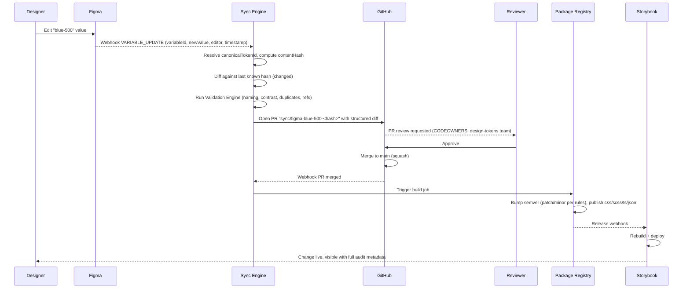
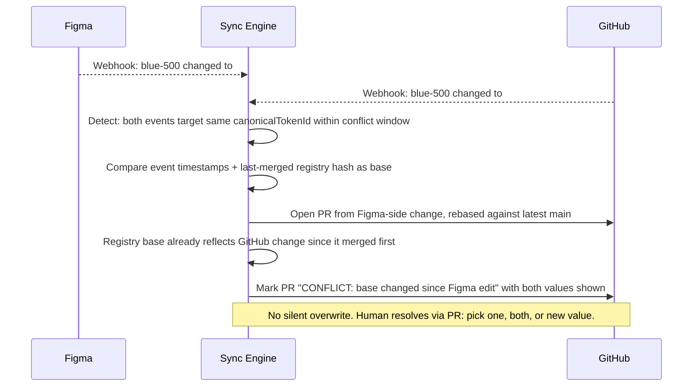

# Design System Synchronization Platform — `skill.md`
### Canonical Engineering Specification — Milestone 1: Color Token Synchronization

**Document status:** RFC — Approved for implementation
**Scope of this milestone:** Color design tokens only. All other token families and components are explicitly out of scope but are architected for from day one.
**Audience:** The implementing AI agent (and any human engineer who inherits this system). This document is written to remove ambiguity, not to summarize.

---

## 1. Executive Summary

Today, three systems — **Figma** (design), **GitHub** (code), and **Storybook** (documentation) — each hold their own copy of color truth, and none of them talk to each other. Every color change is a manual, error-prone, three-way translation, and the systems drift apart within days. Nobody can answer "what is Primary Blue right now?" with confidence.

This document specifies a **Canonical Token Layer (CTL)** architecture: a fourth, invisible system that becomes the single source of truth for token *identity*, while Figma and GitHub remain the two legitimate systems of *edit*. Storybook becomes a pure, generated read-replica. A synchronization engine — built on webhooks, content-hashing, a durable event queue, and a deterministic diff/merge algorithm — keeps all three systems eventually consistent, with human approval gates at every point where irreversible or ambiguous decisions must be made.

The MVP builds only the Color Token slice of this architecture, but every schema, folder, pipeline stage, and governance rule is designed so that Typography, Spacing, Shadows, Motion, Icons, and eventually full Components slot into the *same* pipeline without re-architecture — only new token-type plugins are added.

---

## 2. Vision

One design system. One truth. Three windows onto it.

A designer changes a color in Figma at 9:00am. By 9:10am, a pull request exists in GitHub with the exact diff, validated automatically, human-reviewable in one glance. When merged, packages publish, and by 9:20am every Storybook instance in the organization — and every downstream product using the token packages — reflects the new color, with full accessibility scoring, contrast ratios, and change history attached. No one manually copies a hex code. No one asks "which one is correct." The system is the source of correctness; the humans are the source of intent.

---

## 3. Goals

**G1.** Establish a canonical, versioned, machine-readable model for color design tokens that is independent of any single tool's proprietary format.

**G2.** Enable bidirectional synchronization: changes originating in Figma flow to GitHub/Storybook, and changes originating in GitHub flow back to Figma, without either tool being permanently privileged as "the" source of truth for *editing*.

**G3.** Make every token change auditable, versioned, reviewable, and reversible.

**G4.** Guarantee that Storybook always reflects the last-approved, released state of the token set — never a stale or partially-synced state.

**G5.** Build a validation and governance layer that prevents invalid, inaccessible, duplicate, or ungoverned tokens from ever reaching production.

**G6.** Design every layer (schema, pipeline, repo structure, Storybook contract) to be **token-type agnostic**, so Typography, Spacing, Elevation, Motion, Icons, and Components can be added as new plugins rather than new architectures.

**G7.** Support multi-brand, multi-theme (light/dark/high-contrast), and eventually multi-platform (web/iOS/Android) output from one canonical model.

## 4. Non-Goals (MVP)

- **NG1.** No component token synchronization yet (buttons, cards, inputs). Architecture must not preclude it, but MVP does not implement it.
- **NG2.** No typography, spacing, motion, icon, or elevation tokens in MVP — schema reserves space for them, nothing more.
- **NG3.** No real-time collaborative merge UI (e.g., a custom conflict-resolution GUI) — MVP conflict resolution happens via GitHub PR review and a CLI/Figma-plugin diff viewer.
- **NG4.** No automatic write-back to Figma of arbitrary GitHub-side refactors (renames beyond token identity) — only structured, whitelisted operations sync back automatically (see §22).
- **NG5.** No AI-generated color values in MVP. AI-assisted suggestion is a Phase 5+ roadmap item (§31), not built now.
- **NG6.** No support for design tools other than Figma in MVP (Sketch, Adobe XD are out of scope).

---

## 5. Current Problem (Restated Precisely)

The core failure mode is **directional, silent, and irreversible drift**:

1. **No shared identity.** Figma variables are identified by Figma's internal `VariableId`; GitHub tokens are identified by a JSON key path (`color.blue.500`); Storybook doesn't identify anything — it just renders whatever JSON it was last built with. There is no shared primary key that says "this Figma variable *is* this GitHub token."
2. **No change detection.** Nothing watches Figma for edits. Nothing watches GitHub for edits. Drift is discovered by human accident ("why does the button look wrong?"), not by system alert.
3. **No directionality contract.** When both a Figma edit and a GitHub edit happen to the same token in the same week, there is no defined rule for which wins, so resolution is ad hoc and undocumented.
4. **No versioning.** A token value today has no relationship to the same token's value six months ago. There is no changelog, no semantic version, no deprecation path.
5. **Storybook is a build artifact, not a live view.** It is rebuilt manually and infrequently, so it is *always* the most-stale of the three systems, which is precisely backwards from its role as "the place everyone looks."

The architecture in this document solves all five, in order.

---

## 6. Functional Requirements

- **FR1.** System detects a token creation, edit, rename, or deletion in Figma within minutes (webhook-driven, not polling-dependent).
- **FR2.** System detects a token creation, edit, rename, or deletion in a GitHub token file (via PR/push).
- **FR3.** System computes a content hash per token and per collection to enable cheap diffing.
- **FR4.** System generates a structured, human-reviewable pull request in GitHub for every inbound Figma change, never an unreviewed direct commit to a protected branch.
- **FR5.** System validates every proposed token change against the Validation Engine (§23) before it can merge.
- **FR6.** On merge, system builds and publishes token packages (CSS custom properties, SCSS variables, TypeScript/JS constants, JSON) with semantic version bumps.
- **FR7.** System triggers a Storybook build + deploy on every published token package release.
- **FR8.** System writes approved, structured GitHub-side token changes back into the corresponding Figma Variables via the Figma REST/Variables API, on a defined cadence or event trigger, restricted to value/description changes on already-mapped tokens.
- **FR9.** System maintains a canonical token registry mapping `figmaVariableId ⇄ canonicalTokenId ⇄ githubKeyPath` for every token, versioned in git.
- **FR10.** System produces per-token documentation pages in Storybook containing the full metadata set specified in §20.
- **FR11.** System supports multiple themes (light, dark, high-contrast) and multiple brands as first-class dimensions of the same token, not as separate token sets.
- **FR12.** System flags, and can block, WCAG contrast failures on any token used as text/background pair defined in the semantic layer.
- **FR13.** All state transitions are logged to an immutable audit trail queryable by token ID.

---

## 7. Non-Functional Requirements

| Category | Requirement |
|---|---|
| **Latency** | Figma→PR creation within 5 minutes of a webhook event (p95). GitHub merge→Storybook live within 10 minutes (p95). |
| **Reliability** | Sync engine must guarantee at-least-once delivery of every change event, with idempotent processing (duplicate events must not double-apply). |
| **Consistency model** | Eventual consistency across the three systems, with a defined maximum staleness SLA (15 minutes end-to-end under normal load). |
| **Scalability** | Must support 10,000+ tokens, 50+ brands/themes, 500+ contributors, without redesign — achieved via per-collection sharding of sync jobs. |
| **Auditability** | Every token's full history must be reconstructable from git history + audit log alone, without needing Figma's own history. |
| **Security** | All API credentials (Figma PAT, GitHub App private key) stored in a secrets manager, never in repo or client code. Least-privilege scoping per integration. |
| **Availability** | Sync engine is stateless and horizontally scalable; queue-backed so a worker outage does not lose events. |
| **Extensibility** | Adding a new token type (e.g., Spacing) must require zero changes to the sync engine core — only a new schema module and a new Figma/Storybook adapter. |
| **Observability** | Every pipeline stage emits structured logs + metrics (success rate, latency, queue depth) to a central dashboard. |

---

## 8. Architecture Overview

Three human-facing systems, one invisible arbiter:

```
        ┌────────────┐                         ┌────────────┐
        │   Figma    │                         │  GitHub    │
        │ (Variables)│                         │ (Tokens repo)│
        └─────┬──────┘                         └──────┬─────┘
              │  webhook (variable event)             │  webhook (push/PR)
              ▼                                        ▼
        ┌─────────────────────────────────────────────────────┐
        │            SYNCHRONIZATION ENGINE ("the Sync")        │
        │  Ingest → Normalize → Diff vs Canonical → Validate    │
        │  → Route (PR / Figma write-back) → Publish → Notify   │
        └───────────────────────┬───────────────────────────────┘
                                 │
                                 ▼
                    ┌─────────────────────┐
                    │  Canonical Token     │
                    │  Registry (git-backed│
                    │  JSON, versioned)    │
                    └──────────┬──────────┘
                                │ build
                                ▼
                    ┌─────────────────────┐
                    │  Token Packages      │
                    │  (css/scss/ts/json)  │
                    └──────────┬──────────┘
                                │ publish + webhook
                                ▼
                    ┌─────────────────────┐
                    │     Storybook        │
                    │  (generated, never   │
                    │   hand-edited)       │
                    └─────────────────────┘
```

The Canonical Token Registry is the fourth system referenced in §3 — it lives in GitHub (so it inherits git's versioning, review, and audit properties for free) but is *conceptually* distinct from "the GitHub tokens repo a developer edits by hand." It is the merge output, not a source either side writes to directly except through the Sync Engine's controlled paths.

---

## 9. Recommended Architecture: The Canonical Token Layer (CTL)

**Recommendation: Option C (Canonical Token Layer) as the data model, combined with Option D (Event-Driven Synchronization) as the transport mechanism.** Neither Figma-as-truth nor GitHub-as-truth survives contact with real usage, for reasons detailed in §10. The recommended design has four properties:

1. **Dual-authorable, singly-canonicalized.** Both designers (Figma) and developers (GitHub) can originate a change. Neither writes the canonical registry directly — both write goes through the Sync Engine, which normalizes into one shape before anything is considered "real."
2. **PR-gated, not commit-gated.** All canonical writes land as pull requests, never direct commits, regardless of origin. This makes "who can edit tokens" a solved problem via existing GitHub branch protection and CODEOWNERS — no new permission system needed.
3. **Content-addressed identity.** Every token gets a stable `canonicalTokenId` (a ULID, not a name) at creation time. Names can change (rename scenario, §26 Scenario 5) without breaking identity, because renames are diffed by ID, not by string match.
4. **Storybook as a pure function of the registry.** Storybook build takes the published package as its *only* input. It has no independent state, so "Storybook is out of sync" becomes structurally impossible — it can only be *behind* (a build hasn't run yet), never *different*.

This is the architecture implemented in the rest of this document.

---

## 10. Alternative Architectures Considered

### Option A — Figma as Source of Truth

*Mechanism:* Every color originates and is edited only in Figma. GitHub token files are 100% generated; developers may never hand-edit them.

- **Advantages:** Matches designers' mental model; simplest mental contract ("Figma always wins"); no bidirectional sync complexity; easy to reason about conflicts (there are none, by fiat).
- **Disadvantages:** Developers routinely need to add tokens during implementation spikes (e.g., a one-off state color needed before design has caught up) and will not tolerate being blocked on a Figma edit + export cycle. Emergency production hotfixes (e.g., a contrast-failure fix shipped same-day) become impossible without violating the rule. Figma's Variables API has real rate limits and eventual-consistency quirks that make it a fragile single point of authority for CI/CD-grade releases.
- **Scalability:** Poor at enterprise scale — every brand/theme requires a designer available to make the Figma edit, creating a bottleneck.
- **Developer experience:** Poor — developers become passive consumers, filing tickets against design for trivial value tweaks.
- **Designer experience:** Excellent.
- **Verdict:** Rejected as sole model; Figma remains a first-class *edit* surface, not the *only* one.

### Option B — GitHub as Source of Truth

*Mechanism:* Tokens are hand-authored JSON in GitHub. A one-way export pushes values into Figma (read-only variables, or a "Sync from code" Figma plugin action) for designers to reference.

- **Advantages:** Fits CI/CD and code-review culture perfectly; versioning, PRs, and rollback are native; no dependency on Figma API stability for the critical path.
- **Disadvantages:** Designers lose the ability to explore color in their native tool without filing a dev ticket, which defeats the stated goal of Figma being where "design exploration happens." Design tokens frequently need live visual feedback (contrast against real UI) that is naturally a Figma-side activity; forcing that feedback loop through JSON-then-screenshot is a severe DX regression for designers.
- **Scalability:** Good technically, poor organizationally — designer adoption fails when their tool becomes read-only.
- **Developer experience:** Excellent.
- **Designer experience:** Poor.
- **Verdict:** Rejected as sole model for the same symmetric reason Option A is rejected.

### Option C — Canonical Token Layer (Recommended data model)

*Mechanism:* Neither tool is canonical; a normalized, versioned, ID-based registry sits between them, populated only through validated, reviewed changes from either side.

- **Advantages:** Symmetric respect for both personas; tool-agnostic (a future Sketch or Penpot adapter is just another producer); enables strong validation and governance as a chokepoint that neither tool can bypass; naturally extends to multi-platform output (iOS/Android) because the canonical layer, not a tool export, is the build input.
- **Disadvantages:** More upfront engineering — you must build the normalization/ID-mapping layer instead of relying on one tool's native format; requires discipline to prevent either side from "sneaking" unreviewed direct writes.
- **Scalability:** Excellent — new brands/themes/token types are additive schema, not architecture changes.
- **Verdict:** **Adopted** as the data model of record.

### Option D — Event-Driven Synchronization (Recommended transport model)

*Mechanism:* Webhooks from Figma and GitHub push change events onto a durable queue; workers consume, normalize, diff, validate, and route, rather than a scheduled poller comparing full snapshots.

- **Compared against polling:** Polling (e.g., cron job diffing full Figma export every 15 minutes) is simpler to build but wastes API quota at scale, has a worst-case latency equal to the poll interval even for trivial changes, and cannot distinguish *who* made a change or *why* without extra API calls anyway. Event-driven sync gives near-real-time latency, precise change attribution (Figma webhook payloads include the editor), and lower steady-state API cost — at the price of needing a durable queue and idempotency handling for redelivered/duplicate webhooks.
- **Verdict:** **Adopted** as transport, with a low-frequency reconciliation poll (see §21) as a safety net for missed webhooks — belt and suspenders, not an either/or.

### Summary Comparison Table

| Criterion | A: Figma-truth | B: GitHub-truth | C+D: CTL + Events (Recommended) |
|---|---|---|---|
| Designer experience | Excellent | Poor | Excellent |
| Developer experience | Poor | Excellent | Excellent |
| Conflict handling | Trivial (no conflicts) | Trivial (no conflicts) | Explicit, engineered (§22) |
| Scalability (multi-brand) | Poor | Good | Excellent |
| Governance chokepoint | Weak (Figma has no PR gate) | Strong (native to GitHub) | Strong (enforced at registry) |
| Future multi-platform | Weak | Good | Excellent |
| Engineering upfront cost | Low | Low | Higher (justified by ROI) |

---

## 11. System Diagram (Mermaid)



---

## 12. Data Flow Diagrams

### 12.1 Inbound: Figma Edit → Storybook

```mermaid
flowchart LR
    A[Designer edits variable value in Figma] --> B[Figma emits WEBHOOK: VARIABLE_UPDATE]
    B --> C[Sync Engine ingests event, enqueues]
    C --> D[Normalizer resolves figmaVariableId to canonicalTokenId]
    D --> E{Known token?}
    E -- No --> F[Treat as NEW token proposal]
    E -- Yes --> G[Diff Engine compares new value hash vs last-known hash]
    G --> H{Hash differs?}
    H -- No --> I[Discard - duplicate/no-op event]
    H -- Yes --> J[Validation Engine runs full rule set]
    J --> K{Valid?}
    K -- No --> L[Create PR flagged FAILING, notify author, block auto-merge]
    K -- Yes --> M[Create PR with structured diff + metadata]
    M --> N[Human review + approval]
    N --> O[Merge to main]
    O --> P[Token Build Pipeline runs]
    P --> Q[Packages published with new semver]
    Q --> R[Storybook build triggered]
    R --> S[Storybook deployed - live]
```



### 12.2 Inbound: GitHub Edit → Figma Write-back



---

## 13. Sequence Diagrams

### 13.1 Standard Designer-Originated Color Change



### 13.2 Conflicting Simultaneous Edit (Figma + GitHub, same token)



---

## 14. Canonical Token Model

Every token, regardless of type, shares this envelope (color-specific fields shown; other token types add their own `value` shape later):

```json
{
  "id": "01J8X4K9F3ZQ5R7T2N6M0V8B1C",
  "type": "color",
  "tier": "primitive",
  "name": "blue.500",
  "value": {
    "hex": "#2563EB",
    "rgb": { "r": 37, "g": 99, "b": 235 },
    "hsl": { "h": 221, "s": 83, "l": 53 }
  },
  "description": "Primary brand blue, base tone.",
  "aliasOf": null,
  "brand": "core",
  "themes": ["light", "dark"],
  "deprecated": false,
  "deprecatedInFavorOf": null,
  "figmaVariableId": "VariableID:123:456",
  "figmaCollectionId": "VariableCollectionId:123:1",
  "version": "3.2.0",
  "createdAt": "2025-01-14T10:00:00Z",
  "createdBy": "figma:jane.doe",
  "lastModifiedAt": "2026-07-20T09:03:11Z",
  "lastModifiedBy": "github:john.smith",
  "history": [
    { "version": "3.1.0", "value": { "hex": "#2660E8" }, "changedBy": "figma:jane.doe", "changedAt": "2026-05-02T12:00:00Z", "reason": "brand refresh" }
  ]
}
```

**Design decisions and why:**

- **`id` is a ULID, not a name.** ULIDs are lexicographically sortable (unlike UUIDv4) and time-ordered, which makes registry diffs and audit queries naturally chronological without a separate index. Names change; IDs never do — this is what makes the rename scenario (§26.5) safe.
- **`tier`** encodes position in the token hierarchy (§15) directly on the token, so tooling never has to infer tier from folder location alone (folder location is a convenience mirror, not the source of truth).
- **`aliasOf`** stores the referenced token's `id` (not name) for the same reason — renaming an aliased primitive must not break the alias.
- **`value` is a structured object with hex/rgb/hsl precomputed**, not just a hex string, because Storybook (§20) needs all three without runtime recomputation, and because HSL is what the accessibility/contrast engine and dark-mode generation tooling operate on most naturally (lightness manipulation).
- **`history` is embedded** (last N entries) for fast "what changed" queries in Storybook, in addition to the authoritative full history living in git log — embedded history is a cache, git is the source of truth.
- **`figmaVariableId`/`figmaCollectionId`** are nullable — a token can exist that has no Figma representation yet (created dev-side), which is exactly the asymmetry Option C is designed to tolerate.

---

## 15. Token Taxonomy

Color tokens are organized into a strict five-tier hierarchy. A token in tier *N* may only reference (alias) a token in tier *N-1* or the same tier — never skip down, never reference upward. This directional constraint is what makes the "circular alias" validation rule (§23) tractable and what makes global re-theming (swap one primitive palette, everything downstream updates) possible.

| Tier | Purpose | Editable by | Example |
|---|---|---|---|
| **1. Global / Primitive** | Raw color values with no semantic meaning. The palette. | Design system team only | `blue.500`, `neutral.0`, `red.700` |
| **2. Alias** | A renamed pointer to exactly one primitive, used to create brand-specific vocabulary without duplicating values. | Design system team | `brand.blue = blue.500` |
| **3. Semantic** | Purpose-based tokens describing *role*, not color. This is what components and product teams should consume. | Design system team, reviewed | `color.background.surface`, `color.text.primary`, `color.border.default` |
| **4. Component** | Scoped overrides for a specific component when semantic tokens are insufficient. | Component owners, reviewed | `button.primary.background` |
| **5. State** | Interaction-state variants layered on top of semantic or component tokens. | Design system team | `color.action.primary.hover`, `color.action.primary.active`, `color.action.primary.disabled` |

Additional cross-cutting classifications that apply *across* the tiers above (not a sixth tier, but tags/dimensions on any tier):

- **Theme tokens:** the same semantic token (`color.background.surface`) resolves to a different primitive depending on active theme mode (`light` | `dark` | `high-contrast`). Modeled as **Figma Modes** on the same Variable, and as a `themes` map in the canonical model, never as separately-named tokens (`color.background.surface.dark`) — duplicate naming for theme variants is explicitly rejected because it breaks automatic theme-switching in code (CSS custom properties should resolve via `[data-theme]` selectors against the *same* variable name).
- **Brand tokens:** for multi-brand orgs, brand is modeled as a separate dimension (a Figma Collection per brand, aliasing shared primitives), not as a naming suffix. `brand.core.blue` and `brand.acme.blue` may point to different primitives while `color.action.primary` stays brand-agnostic at the semantic tier.
- **Accessibility tokens:** not a separate tier — a computed, validated *property* attached to any text/background semantic pairing (contrast ratio, WCAG AA/AAA pass/fail), stored in the token's metadata and re-validated on every change to either side of the pairing.
- **Dark Mode / High Contrast:** implemented as additional Figma Modes within existing Collections, never as a parallel token tree, for the same reasons as theme tokens above.

**Why this hierarchy over a flatter one:** IBM Carbon and Adobe Spectrum both converge on a primitive→semantic split for the same reason we do — semantic tokens are the contract product teams build against, and that contract must be stable even when primitives are entirely repainted during a brand refresh. We add the **Component** and **State** tiers explicitly (rather than leaving them implicit) because without a named tier, component-level overrides get created ad hoc with no governance path, which was a known failure mode reported in Atlassian's design system evolution — override sprawl becomes untrackable within two years without a dedicated, validated tier for it.

---

## 16. Naming Conventions

### 16.1 Primitive naming: `{hue}.{step}`

```
neutral.0, neutral.50, neutral.100, neutral.200 ... neutral.900, neutral.1000
blue.0, blue.50, blue.100 ... blue.900, blue.1000
red.0 ... red.900
green.0 ... green.900
```

- **Numeric step scale (0–1000, increments of 50–100), not descriptive words** ("dark blue", "sky blue"). Descriptive names collide across future palettes (is "sky blue" lighter or darker than "light blue"?) and don't communicate ordering. A numeric scale is unambiguous, sortable, and matches the convention already proven at scale by Tailwind, Material, and Radix — we deliberately align with prior art here rather than inventing new terms, because internal tooling (contrast calculators, ramp generators) already assumes numeric steps.
- **0 = lightest (usually near-white), 1000 = darkest (usually near-black)**, consistent across every hue, so `neutral.900` and `blue.900` are always comparably dark.

### 16.2 Semantic naming: `color.{category}.{role}[.{variant}][.{state}]`

```
color.background.canvas
color.background.surface
color.background.surface.raised
color.text.primary
color.text.secondary
color.text.disabled
color.text.inverse
color.border.default
color.border.subtle
color.action.primary
color.action.primary.hover
color.action.primary.active
color.action.primary.disabled
color.feedback.error
color.feedback.warning
color.feedback.success
```

- **Dot-delimited, lowercase, category-first.** Category-first (`color.background.*` rather than `background.color.*`) groups all color tokens under one namespace root, which matters once Typography/Spacing tokens exist alongside color in the same registry (`typography.heading.lg`, `spacing.inset.md` — the type is always the first segment).
- **State is always the last segment**, never embedded mid-name, so a simple regex/tooling rule (`.hover$`, `.active$`, `.disabled$`) can universally identify state tokens across every category without per-category special-casing.
- **No brand or theme name embedded** (rejecting `color.action.primary.dark` or `color.action.primary.acme`) — those are resolved dimensionally via Figma Modes/Collections and the `brand`/`themes` fields on the token record, not via string suffixing. This is the single most important naming rule in the system: **a semantic token name must be stable across every brand and every theme.** The moment a name encodes a theme or brand, automatic theme/brand switching in code breaks, because switching would require a find-and-replace of class names rather than a CSS custom-property/context swap.

### 16.3 Comparison against the W3C Design Tokens Community Group (DTCG) format

The W3C DTCG draft specifies `$value`, `$type`, `$description`, and `$extensions` keys, with references via `{token.path}` curly-brace syntax. Our canonical model is a **superset** of DTCG, not a divergence:

- We adopt `$value`/`$type`/`$description` as the *serialized export shape* for interoperability with Token Studio and any DTCG-compliant tool.
- We add `id`, `figmaVariableId`, `history`, and `tier` as **non-DTCG extension fields** under `$extensions.canonical`, so a DTCG-only consumer can still parse our files and safely ignore the extension block.
- We deliberately do **not** use DTCG's raw `{blue.500}` reference syntax as our *internal* alias mechanism — internally, aliases reference by `id` (ULID) as justified in §14, and are only rendered to DTCG's name-based `{}` syntax at export time. This avoids the classic DTCG pitfall where a primitive rename silently breaks every alias that referenced it by name.

---

## 17. Folder Structure

```
design-tokens/
├── tokens/
│   ├── colors/
│   │   ├── primitive.json          # Tier 1 — global palette, ULID-keyed
│   │   ├── semantic.json           # Tier 3 — role-based tokens, alias by id
│   │   ├── component.json          # Tier 4 — component-scoped overrides
│   │   ├── state.json              # Tier 5 — interaction states
│   │   └── themes/
│   │       ├── light.json          # Mode resolution map per theme
│   │       ├── dark.json
│   │       └── high-contrast.json
│   └── _registry/
│       ├── canonical-registry.json # Full merged model, machine-generated, PR-diffable
│       └── figma-mapping.json      # figmaVariableId <-> canonicalTokenId table
│
├── generated/                      # 100% build output — never hand-edited, gitignored except lockfiles
│   ├── css/
│   │   └── colors.css              # :root and [data-theme] custom properties
│   ├── scss/
│   │   └── _colors.scss
│   ├── typescript/
│   │   └── colors.ts               # typed constants + union types for autocomplete
│   ├── json/
│   │   └── colors.tokens.json      # DTCG-compliant export
│   └── storybook/
│       └── color-docs.json         # Denormalized, Storybook-ready doc payload (§20 shape)
│
├── scripts/
│   ├── figma-extract.ts            # Pull Figma Variables via API -> normalized events
│   ├── figma-writeback.ts          # Push whitelisted changes back to Figma
│   ├── build-tokens.ts             # Registry -> generated/* transforms (Style Dictionary-based)
│   ├── validate-tokens.ts          # Runs Validation Engine (§23) as a standalone CLI, used by CI
│   └── contrast-check.ts           # WCAG contrast computation over semantic pairings
│
├── pipelines/
│   ├── figma-sync.yml              # Triggered by Figma webhook relay
│   ├── validate.yml                # Required check on every PR
│   ├── release.yml                 # Runs on merge to main: build, version, publish
│   └── storybook-deploy.yml        # Triggered by package publish
│
├── docs/
│   ├── skill.md                    # This document
│   ├── ADRs/                       # Architecture Decision Records, one file per decision
│   └── CHANGELOG.md                # Human-readable, auto-generated from semver history
│
└── package.json
```

**Why each top-level folder exists:**

- **`tokens/`** is the only hand-editable (by humans or the Sync Engine's PR bot) source. Everything else is derived.
- **`_registry/`** is separated from the tier files because it is *machine-owned* — humans edit `primitive.json`/`semantic.json`/etc., and a build step regenerates `canonical-registry.json` and the Figma mapping table as a merge artifact. Keeping it in its own folder makes "never hand-edit this" an enforceable CODEOWNERS + CI rule rather than a convention people forget.
- **`generated/`** is fully derived output, checked in (not gitignored) specifically so that `git diff` on a release PR shows the human-readable *consequence* of a token change (e.g., the exact CSS line that changed), which is invaluable during review — this is a deliberate deviation from the common "don't commit build output" rule, justified because reviewability here outweighs repo bloat at token-scale (kilobytes, not megabytes).
- **`scripts/`** holds the transform logic as versioned, testable code rather than opaque CI-only shell — every script is runnable locally by a developer debugging a sync failure.
- **`pipelines/`** isolates CI/CD definitions so the pipeline itself is reviewable and versioned the same way tokens are.
- **`docs/ADRs/`** exists because every non-obvious decision in this document (e.g., "why ULIDs," "why commit generated output") deserves a standalone record that survives this document being edited later.

---

## 18. Figma Standards

**Collections and Modes:**

- One **Collection per brand** (`Core`, `Acme`, `Globex`), containing all primitive, alias, semantic, component, and state variables for that brand. This keeps brand as a hard boundary matching how Figma's own permission model (per-collection sharing) works, rather than relying on naming discipline.
- Within each Collection, **Modes represent themes**: `Light`, `Dark`, `High Contrast`. A semantic variable like `color/background/surface` is a single Variable with three Mode values, never three separately named variables — this is the Figma-side mechanism that keeps our "no theme suffix in the name" naming rule (§16.2) enforceable.
- A separate, shared **`Primitives` Collection** holds the numeric palette (`blue/500`, `neutral/0`, etc.) and is referenced *by alias* from every brand Collection. Only one org-wide source of raw color values exists; brand Collections may alias a shared primitive or introduce brand-exclusive primitives, but never redefine a shared primitive's value locally (that would silently fork the "same" token per brand, defeating shared theming).

**Folder / grouping structure inside a Collection** (Figma Variables support `/`-delimited grouping, which maps directly onto our dot-delimited semantic names):

```
background/canvas
background/surface
background/surface/raised
text/primary
text/secondary
action/primary
action/primary/hover
```

**Naming discipline:** Figma Variable names use `/` where the canonical model uses `.` — this is a pure serialization difference, translated 1:1 by the extraction script (`figma-extract.ts`), never a divergence in meaning.

**Alias usage:** Designers create alias relationships using Figma's native "alias to another variable" feature, pointed at the shared `Primitives` collection or another semantic variable. The extraction script resolves Figma's internal alias references to our `id`-based `aliasOf` field automatically — designers never need to know about ULIDs.

**Multi-brand support:** New brand = new Collection, aliasing `Primitives` where possible. This is intentionally a Figma-side operation a design system admin can perform without any code deploy, satisfying the "brand added" scenario (§26.4) with minimal engineering involvement.

**Localization considerations:** Color tokens are not localized (RTL/LTR affects spacing/layout tokens, a future milestone, not color) — noted here only to confirm it is explicitly out of scope for this token type, avoiding future ambiguity.

**Enterprise recommendation:** Lock the `Primitives` Collection with Figma's variable-scoping/permissions to a small design-system-owner group; leave brand Collections editable by broader design teams under those brands. This mirrors the tiered editability already defined in §15.

---

## 19. GitHub Standards

- **Repository:** a single dedicated `design-tokens` repo (not folded into a monorepo with component code) so its release cadence, versioning, and permissions are independent of any one product's repo — matching how Adobe Spectrum and IBM Carbon both ship tokens as a standalone versioned package consumed by many downstream repos.
- **Branch protection on `main`:** required status checks = `validate-tokens`, `contrast-check`; required reviews = 1 from `@design-system/token-owners` (CODEOWNERS-enforced on `tokens/**`); no direct pushes, including from the Sync Engine's bot identity — even automated PRs go through the same gate as a human PR.
- **PR bot identity:** a GitHub App (not a personal access token tied to an individual) creates Figma-originated PRs, so review, audit, and revocation are enterprise-manageable independent of any one employee's account.
- **Commit convention:** Conventional Commits (`feat(tokens):`, `fix(tokens):`, `chore(tokens):`) drives automatic semantic version bumps in the release pipeline (§27) — no manual version number editing, ever.
- **Tags/Releases:** every published package version is a GitHub Release with auto-generated notes (from Conventional Commits) plus a structured token diff summary (which token IDs changed, old value → new value).

---

## 20. Storybook Standards

Storybook is generated entirely from `generated/storybook/color-docs.json` — it has no manual MDX content for token pages, ensuring the "Storybook is a pure function of the registry" guarantee from §9. Each color token gets an auto-generated documentation page containing:

| Field | Source | Why it matters |
|---|---|---|
| Token Name | `name` | Canonical identity for search |
| Description | `description` | Usage intent, not just value |
| HEX / RGB / HSL | `value.*` | Every color-format consumer covered without recomputation |
| CSS Variable | derived: `--color-{dot-to-dash}` | Copy-paste into code |
| TypeScript Variable | derived: `Colors.background.surface` | Copy-paste with autocomplete |
| Accessibility (WCAG score, contrast ratio) | computed by `contrast-check.ts` against paired tokens | Prevents inaccessible usage before it ships |
| Theme Availability | `themes[]` | Shows if a token resolves in light/dark/high-contrast |
| Usage — Do / Don't | curated metadata field, authored by design-system team in a `guidance.json` sidecar (the one hand-authored, non-generated input Storybook accepts, explicitly scoped to prose guidance only, never values) | Values are generated; *judgment* about correct usage is inherently human and is the one deliberate exception to "no hand-authored Storybook content" |
| Alias / Inheritance chain | walked via `aliasOf` recursively | Shows the full primitive→semantic lineage |
| Dependencies / Linked Components | reverse-index of `component.json` references | Answers "what breaks if I change this" before you change it |
| Last Updated / Author | `lastModifiedAt` / `lastModifiedBy` | Direct audit visibility, no need to check git log |
| Version | `version` (per-token semver-like counter, see §21) | Pin-pointable in bug reports |
| GitHub Link | deep link to the token's line in `primitive.json`/`semantic.json` at the commit that last changed it | One click to source |
| Figma Link | deep link via `figmaVariableId` to `https://figma.com/design/{fileKey}?node-id={variableId}` | One click to design source |
| Deprecation Status / Migration Notes | `deprecated`, `deprecatedInFavorOf` | Prevents new usage of sunsetting tokens |
| Visual Preview | rendered swatch, plus live preview against both a light and dark canvas token | Immediate visual sanity check without leaving the page |

**Why generate rather than hand-author:** the instant a human can hand-edit a Storybook page's *values*, Storybook re-acquires its own state and the eventual-consistency guarantee collapses back into the original three-way-drift problem. The single deliberate exception (Do/Don't guidance prose) is scoped narrowly enough that it cannot desynchronize *values* — only *advice*, which has no correctness contract to violate.

---

## 21. Synchronization Engine

**Change detection:** Figma Webhooks API (`FILE_VARIABLES_UPDATE` event, generally available on Enterprise plans) is the primary trigger. GitHub webhooks (`push`, `pull_request.closed` with `merged: true`) are the code-side trigger.

**Reconciliation poller (safety net):** every 30 minutes, a low-priority job pulls a full Figma Variables export and a full registry snapshot and diffs them by content hash. This exists because webhooks can be missed (delivery failure, endpoint downtime) — the poller guarantees an upper bound on drift (30 min) even in total webhook failure, without making the primary path polling-based (which would impose that latency on *every* change, not just missed ones).

**Diff engine:** every token's `value` object is hashed (SHA-256 of canonical JSON serialization). A change event only proceeds past the Normalizer if the new hash differs from the last-known hash stored in the registry — this makes the pipeline naturally idempotent against duplicate/redelivered webhooks (FR: at-least-once delivery, exactly-once effect).

**Event bus / queue:** a durable, ordered-per-key queue (e.g., SQS FIFO with `canonicalTokenId` as the message group ID, or equivalent) ensures that two rapid edits to the *same* token are processed in order relative to each other, while edits to *different* tokens process in parallel — this is what makes the sync throughput scale with organization size (§7 scalability) rather than serializing all changes globally.

**Retries:** exponential backoff (1s, 5s, 30s, 5m, 30m), max 5 attempts, then dead-letter queue with alerting to the platform team — a failure never silently disappears.

**Rollback / recovery:** because every canonical write is a merged git commit, rollback is `git revert` of the offending commit, which re-triggers the standard release pipeline (build → publish → Storybook deploy) — rollback uses the *same* pipeline as forward changes, not a special-cased path, which is a deliberate simplicity choice that avoids an entire class of "the rollback path itself has bugs nobody tested" incidents.

**Partial failure:** if Storybook deploy fails after a successful package publish, the package version is still valid and usable by downstream consumers (npm/CSS CDN) — Storybook staleness is logged and alerted but does not block or roll back the already-successful package release, because blocking code consumers on a documentation deploy failure would be a worse failure mode than temporarily stale docs.

**Offline handling:** if GitHub or Figma is unreachable when the Sync Engine attempts a write, the job retries per the backoff policy above; the *source* event remains in the queue (not acknowledged) until a write succeeds or the DLQ threshold is hit, guaranteeing no event is lost to a transient outage.

**Large organizations / performance:** sync jobs are sharded by `figmaCollectionId` (effectively, by brand), so a large edit batch in one brand's Collection does not delay processing of an unrelated brand's changes. Figma API rate limits (per-file, per-minute) are respected via a token-bucket limiter per file key, with jobs queued rather than dropped on limit-exceeded.

**Security / authentication:** Figma access via a scoped Enterprise API token restricted to the specific files in scope, stored in a secrets manager (e.g., AWS Secrets Manager / HashiCorp Vault) and injected at runtime, never in repo. GitHub access via a GitHub App with the minimum permission set (`contents:write`, `pull_requests:write`, `checks:write` on the single `design-tokens` repo only) rather than a broad personal token. All webhook payloads are signature-verified (Figma's webhook secret, GitHub's `X-Hub-Signature-256`) before being trusted.

---

## 22. Conflict Resolution

Conflicts are detected, never silently resolved. The rule set:

1. **Same token, same direction (two Figma edits, or two GitHub edits), sequential:** last-write-wins is safe because it's the same system's own edit history — Figma's and git's own history already sequences these correctly.
2. **Same token, opposite direction (Figma edit and GitHub edit), overlapping in time:** the Sync Engine detects this by checking whether the registry's base hash (at the time the Figma-side PR is being opened) already differs from the hash the Figma event was diffed against. If so, the PR is explicitly labeled `sync-conflict`, includes both proposed values with full metadata (who, when, from which system), and requires a human decision — auto-merge is disabled on any PR carrying this label, enforced by branch protection ("must not have label `sync-conflict`" as an additional required check).
3. **Write-back conflicts (GitHub change should propagate to Figma, but the Figma variable was edited after the GitHub PR was opened):** the write-back job re-checks the Figma variable's `lastModified` timestamp immediately before writing; if it has changed since the GitHub PR's base, the write-back is aborted and a `figma-writeback-conflict` ticket/notification is raised instead of overwriting a designer's newer edit.
4. **Rename vs. delete race** (one system renames a token while the other deletes it): resolved by ID — a rename changes `name` but keeps `id`; a delete removes the `id` entirely. If both events arrive, the delete is treated as authoritative only after human confirmation, because an accidental delete is higher-cost to get wrong than an accidental rename.

No conflict is ever resolved by silent overwrite. This is the single non-negotiable rule of the whole engine, because silent overwrite is the exact mechanism that produced the original problem statement (§5).

---

## 23. Validation Engine

Runs as a required CI check (`validate-tokens.ts`) on every PR, and as a pre-check inside the Sync Engine before a PR is even opened (fail fast, don't create a doomed PR). Rules:

| Rule | Check | Severity |
|---|---|---|
| Duplicate names | No two tokens share the same fully-qualified name within a Collection/theme scope | Blocking |
| Duplicate values | Warn (not block) when two primitives share an identical hex value — may be intentional (aliasing candidates) | Warning |
| Unused tokens | A semantic/component token with zero references from any component mapping or Storybook usage index for >90 days | Warning, surfaced in a quarterly cleanup report |
| Circular aliases | `aliasOf` graph must be a DAG; any cycle is rejected at commit time | Blocking |
| Missing aliases | An `aliasOf` pointing to a non-existent `id` | Blocking |
| Accessibility failures | Any semantic text/background pairing declared in `contrast-pairs.json` must meet WCAG AA (4.5:1 normal text, 3:1 large text/UI); AAA is advisory | Blocking for AA, Warning for AAA |
| Invalid naming | Name must match the tier-appropriate regex from §16 (e.g., primitives must match `^[a-z]+\.\d{1,4}$`) | Blocking |
| Broken references | Any `figmaVariableId` in the mapping table that no longer resolves on the Figma side (deleted upstream without a corresponding delete event processed) | Blocking, requires reconciliation |
| Theme mismatch | A token declaring `themes: ["light","dark"]` must have a resolvable value in both modes in Figma | Blocking |
| Missing documentation | `description` field empty on any Tier 3+ (semantic and above) token | Blocking for semantic/component/state tiers; Warning for primitives |
| Color collisions | Two *semantically distinct* roles (e.g., `error` and `action.primary`) resolving to the identical hex in the same theme, which risks user confusion | Warning |
| Enterprise governance | Any change to the `Primitives` tier requires the `@design-system/core-owners` review group specifically, enforced via a path-scoped CODEOWNERS rule, not the general token-owners group | Blocking |

Validation results are attached to the PR as a structured comment (not just a pass/fail badge), listing every rule evaluated and its outcome, so a reviewer never has to guess why a check failed.

---

## 24. Versioning Strategy

- **Token-level version:** every token carries its own monotonically increasing version counter (visible in Storybook, §20), independent of the package-level semver, so "when did *this specific token* last change" is answerable without cross-referencing package changelogs.
- **Package-level Semantic Versioning:** the published `@org/design-tokens` package follows strict semver —
  - **MAJOR:** any token deletion, or any rename without a deprecation alias, or any breaking value change to a token flagged `stable: true` in a way that fails a downstream visual regression threshold.
  - **MINOR:** new tokens added, new theme/brand support added, non-breaking value adjustments to existing tokens.
  - **PATCH:** documentation-only changes, description edits, metadata corrections with no value change.
- **Deprecation:** a token is never hard-deleted in one step. Deletion scenario (§26.6) always passes through a `deprecated: true` + `deprecatedInFavorOf: <id>` state for at least one MINOR release cycle before physical removal in the next MAJOR, giving consumers a migration window. Storybook surfaces deprecation prominently (§20).
- **Migration notes:** auto-generated from the diff between the deprecated token and its replacement, plus an optional human-authored note field for anything the diff can't express (e.g., "also update your button padding, this color implies a new density").
- **Backward compatibility:** old package major versions remain published and installable (not unpublished) for at least 2 major versions back, per standard npm semver-range consumer expectations.
- **Audit trail:** the embedded `history[]` array (§14) plus full git history plus the immutable audit log (§7) provide three independent, cross-checkable sources of "what happened when," which is intentional redundancy — any one being unavailable (e.g., git history rewritten in an emergency) still leaves two sources to reconstruct truth from.
- **Release notes:** auto-generated per release from Conventional Commit messages, augmented with the structured token diff (old value → new value, per token, with Figma/GitHub links).
- **Approval workflow:** MAJOR (breaking) releases require an additional sign-off from a `@design-system/release-manager` role beyond the standard token-owner review, gating on the semver-impact label the release pipeline computes automatically from the Conventional Commit analysis.

---

## 25. Governance Model

| Role | Can edit Primitives | Can edit Semantic/Component/State | Can approve PRs | Can trigger a MAJOR release |
|---|---|---|---|---|
| Designer (brand team) | No (Primitives locked, §18) | Yes, within their brand's Collection | No | No |
| Design System Owner | Yes | Yes | Yes (required reviewer on Primitives) | No |
| Developer | No (via Figma); Yes (via GitHub PR, still reviewed) | Yes, via GitHub PR | No (unless also a token-owner) | No |
| Token Owner (CODEOWNERS group) | Yes | Yes | Yes (required) | No |
| Release Manager | — | — | — | Yes (required sign-off on MAJOR) |

**Publishing workflow:** only the release pipeline (§27), triggered by a merge to `main`, may publish a package version. No individual has direct publish credentials to the package registry — this closes the loop that governance-without-enforcement typically fails on (a policy that isn't technically enforced eventually gets bypassed under deadline pressure).

**Enterprise ownership:** the `design-tokens` repo is owned by the Design Systems team org-wide, with brand-specific Figma Collections delegated to brand design leads for day-to-day editing rights, but Primitives and the release pipeline itself remain centrally owned — this mirrors the "federated editing, centralized governance" model used by both Atlassian's and Shopify Polaris's design system teams.

---

## 26. Change Scenarios

**Scenario 1 — Designer changes a token.** Figma webhook fires → Sync Engine normalizes, diffs, validates → PR opened → reviewed → merged → published → Storybook redeployed. (Full sequence: §13.1.)

**Scenario 2 — Developer changes JSON.** Developer edits `semantic.json` in a feature branch → opens PR → `validate-tokens` and `contrast-check` run as required checks → reviewed by token-owner → merged → registry updated → if the token is Figma-mapped and the change is a whitelisted field (value or description), a write-back job updates the Figma Variable; otherwise it's flagged for manual designer follow-up.

**Scenario 3 — Theme updated (e.g., new "high contrast" mode added org-wide).** Design-system owner adds a new Mode to every Collection in Figma → bulk `MODE_ADD` events arrive → Sync Engine batches them as a single logical PR (batched by a debounce window, not one PR per token, to avoid PR-storm) → validation runs contrast checks specifically for the new mode against every existing semantic pairing → single reviewed PR merges the new theme dimension → build pipeline emits new CSS `[data-theme="high-contrast"]` block → Storybook gains a new theme toggle option automatically (theme list is read from the registry, not hardcoded in Storybook).

**Scenario 4 — Brand added.** Design-system owner creates a new Figma Collection aliasing `Primitives` → initial full-collection sync produces one large PR ("new brand: Acme") requiring Release Manager sign-off (treated as MINOR at minimum, since it's purely additive) → on merge, a new brand-scoped package export (`@org/design-tokens/acme`) is added to the build matrix.

**Scenario 5 — Token renamed.** Designer renames `blue/500` to `azure/500` in Figma. Because identity is ID-based (§14), the Sync Engine detects "same `figmaVariableId`, new name" — this is diffed as a **rename event**, not a delete+create. The PR shows a rename diff; on merge, every `aliasOf` reference (by ID) continues resolving correctly with zero additional changes required. The `generated/css` output changes the CSS custom property name, which the build pipeline treats as a MAJOR-eligible change *unless* a backward-compatible alias is auto-emitted (`--color-blue-500: var(--color-azure-500);` for one deprecation cycle) — this backward-compatible alias emission is the default behavior, downgrading the impact to MINOR.

**Scenario 6 — Token deleted.** Never immediate. First transitions to `deprecated: true` (§24) for at least one MINOR cycle, surfaced in Storybook with migration notes, then physically removed only in a subsequent MAJOR release with Release Manager sign-off.

**Scenario 7 — Breaking change.** Any change matching the MAJOR criteria (§24) is auto-labeled `semver:major` by the release pipeline's commit analysis; this label triggers the additional Release Manager approval gate (§24/§25) before the release job is allowed to run, regardless of whether the merge to `main` already happened — merge and release are decoupled steps precisely so a MAJOR-labeled merge can sit reviewed-but-unreleased until sign-off, without blocking other unrelated tokens' releases from proceeding on their own schedule... *except* MVP ships one package per token-type, so in practice a pending MAJOR approval does gate the whole color package's next release; this is a known MVP limitation, and per-token independent release cadence is a Phase 4+ enhancement (§31).

**Scenario 8 — Merge conflict** (two GitHub PRs touching the same token file region). Standard git merge conflict; resolved by the second PR's author rebasing — this is intentionally left to git's native tooling rather than custom-built, since GitHub PR conflicts on JSON files are already a well-understood developer workflow.

**Scenario 9 — Parallel editing** (a Figma-side change and a GitHub-side change to the *same token* within the sync latency window). Covered fully in §22, rule 2 — flagged, never silently merged.

**Scenario 10 — Failed Storybook deployment.** Package publish is not blocked or rolled back (§21, partial failure handling); a dashboard alert fires; the deploy step retries per the standard backoff policy; if it exhausts retries, an on-call notification is raised, and Storybook displays its last-successfully-deployed version with a visible "docs may be behind published package" banner (a dedicated build-metadata check the Storybook shell itself performs against the latest package version tag) — this banner is the one mechanism by which Storybook is allowed to represent staleness explicitly rather than silently rendering an old state as if current.

---

## 27. CI/CD Pipeline

```
Figma Update
    │
    ▼
Extraction (figma-extract.ts, triggered by webhook)
    │
    ▼
Validation (validate-tokens.ts + contrast-check.ts — pre-check before PR creation)
    │
    ▼
PR Creation (structured diff, metadata, links back to Figma node)
    │
    ▼
Review (CODEOWNERS-enforced: token-owners; core-owners additionally for Primitives)
    │
    ▼
Merge to main (squash, Conventional Commit message enforced by commit-lint check)
    │
    ▼
Token Build (build-tokens.ts — Style Dictionary transform: registry -> css/scss/ts/json)
    │
    ▼
Semver Determination (Conventional Commit analysis -> patch/minor/major)
    │
    ▼
Package Publish (to internal npm registry + CDN-hosted CSS bundle)
    │
    ▼
Storybook Build (consumes published package as sole input, §9)
    │
    ▼
Deployment (Storybook static site to hosting, cache-busted)
    │
    ▼
Notification (Slack: #design-system-releases, with token diff summary + links)
    │
    ▼
Analytics (release metrics: token count, breaking-change rate, time-to-publish, logged to observability stack, §29)
```

Each stage is its own pipeline job (`pipelines/*.yml`) with its own required-check status, so a failure at any stage is independently visible and independently retriable, rather than one monolithic script whose failure point requires log-spelunking to locate.

---

## 28. Security Considerations

- **Least privilege throughout:** Figma API token scoped to the specific files in the design system's Figma project only, not org-wide; GitHub App scoped to the single `design-tokens` repo.
- **No secrets in code or config files:** all credentials pulled from a secrets manager at runtime; CI jobs use short-lived, scoped tokens (e.g., GitHub Actions OIDC federation to avoid long-lived PATs entirely where possible).
- **Webhook signature verification:** every inbound webhook (Figma, GitHub) is verified against its provider's signing secret before its payload is trusted or enqueued; unverified payloads are dropped and logged as a security event.
- **Write-back is allow-listed, not general-purpose:** the Figma write-back job can only PATCH `value` and `description` fields on variables already present in `figma-mapping.json` — it has no capability to create, delete, or rename Figma variables, structurally limiting the blast radius of a compromised or buggy write-back job.
- **Audit log is append-only and access-controlled** separately from the general engineering org, readable by security/compliance without write access.
- **Dependency supply chain:** the token build pipeline (Style Dictionary and related tooling) is pinned to exact versions with lockfiles, and the build environment is the same containerized, reproducible image used across all pipeline stages, reducing the risk of a compromised transitive dependency silently altering published color values.

---

## 29. Scalability Strategy

- **Per-brand Collection sharding** (§21) means sync throughput scales roughly linearly with number of brands, not global token count, since most edit activity is brand-local.
- **Batched PRs for bulk events** (Scenario 3, theme-wide changes) prevent PR-storm — a debounce window (e.g., 60 seconds of quiet time after the last event in a batch) groups related changes into one reviewable unit rather than hundreds of tiny PRs.
- **Reconciliation poller is O(collections), not O(tokens)** per run in the common case — it hash-compares whole-collection digests first, and only descends into per-token diffing for collections whose digest changed, keeping steady-state poll cost low even at 10,000+ tokens.
- **Package registry consumption model:** downstream product teams pin to a semver range (`^3.0.0`), so publishing a new color package version does not require every consuming repo to take action immediately — this decouples design-system release cadence from every consumer's own release cadence, which is essential once dozens of product repos depend on the same package.
- **Storybook build performance:** because Storybook's only input is the generated package (§9), Storybook build time scales with token count linearly and predictably, and can be further optimized later (Phase 4+) via incremental/only-changed-token doc regeneration rather than a full rebuild every release.

---

## 30. Observability and Monitoring

- **Pipeline dashboards:** per-stage success rate, p50/p95/p99 latency (Figma edit → PR open → merge → publish → Storybook live), and queue depth, all tracked centrally.
- **Structured logs:** every Sync Engine action logs `canonicalTokenId`, event source, event type, and outcome as structured (JSON) log lines, queryable by token ID — directly supporting the "reconstruct any token's history" audit requirement (§7) independent of git.
- **Alerting:** DLQ depth > 0 pages the on-call platform engineer; validation failure rate spike (>10% of PRs failing a given rule within 1 hour) alerts the design-system team, since it usually indicates a systemic issue (e.g., a bad bulk Figma edit) rather than isolated bad tokens.
- **Business-facing metrics:** time-to-publish (design change → live in Storybook), breaking-change frequency, deprecated-token usage trend (are consumers migrating off deprecated tokens in time) — reported monthly to design-system stakeholders as a health scorecard.

---

## 31. Risks and Trade-offs

| Risk | Mitigation / Accepted Trade-off |
|---|---|
| Figma Variables API rate limits under bulk edits (Scenario 3/4) | Batching + debounce window; sharded, rate-limited extraction jobs |
| Committing `generated/` bloats repo history over years | Accepted trade-off for review clarity (§17); periodic history-squash of the `generated/` path only, tokens' own history in `tokens/` remains untouched |
| Write-back to Figma could theoretically clobber a designer mid-edit | Mitigated by pre-write timestamp re-check (§22 rule 3), not eliminated — residual risk accepted as low-probability given the narrow write-back window |
| Single package-per-token-type MVP gates unrelated MAJOR changes together (§26 Scenario 7 caveat) | Accepted for MVP; per-token independent release cadence deferred to Phase 4 |
| Reconciliation poller's 30-minute worst-case drift window | Accepted; webhook path handles the overwhelming majority of changes at low latency, poller is a bounded-worst-case safety net, not the primary path |
| Governance overhead (required reviews, Release Manager sign-off) may feel slow to designers used to instant Figma publish | Intentional — the entire point of the architecture is trading raw speed for correctness and auditability; mitigated by keeping MINOR/PATCH review fast (single token-owner, no Release Manager gate) |

---

## 32. Future Enhancements (Roadmap Beyond Color MVP)

The canonical model, folder structure, and pipeline are deliberately generic across token *type* (§6 G6). Extending to each future token family requires only:

1. **A new schema module** under `tokens/{type}/` following the same tier structure (primitive → alias → semantic → component → state), reusing the *same* `id`/`aliasOf`/`history`/`figmaVariableId` envelope from §14.
2. **A new Figma adapter** mapping that type's Figma representation (e.g., Typography Styles, Effect Styles for shadows) into the canonical envelope — the Sync Engine core (queue, diff, validate, route) requires zero changes.
3. **A new Style Dictionary transform** emitting that type's `generated/` output shape (e.g., `@font-face` + CSS custom properties for Typography; keyframe/duration/easing constants for Motion).
4. **A new Storybook doc template** extending the same denormalized-JSON-in, generated-page-out model from §20, adding type-specific fields (e.g., "Duration" and "Easing Curve" for Motion, in place of "Contrast Ratio").

This is how the roadmap is enabled without re-architecture:

- **Typography, Spacing, Elevation, Motion, Icons, Illustrations:** each is "just" a new schema + adapter + transform + doc template, per above.
- **Component tokens (buttons, cards, inputs):** the Component tier (§15, Tier 4) already exists in the color model specifically so full component tokenization is additive, not a new tier concept.
- **Multi-platform output (React, Angular, Vue, SwiftUI, Jetpack Compose, Flutter, Android XML, iOS):** because the canonical registry — not any single tool's export — is the build pipeline's input, adding a platform is a new Style Dictionary transform target, not a new source of truth.
- **Auto-generated Storybook stories for full components:** once component tokens and component metadata (props, variants) are modeled with the same ID-based, versioned envelope, Storybook's existing "generate from data" pattern extends from token docs to full interactive component stories.
- **AI-assisted token suggestions / Design-to-Code:** the canonical registry, with its full history, usage index (which components reference which tokens), and accessibility metadata, is precisely the structured training/context data an AI suggestion feature would need — this is *why* the registry is built as a rich, queryable model now rather than a flat key-value file, even though MVP itself does not build any AI feature.

---

## 33. Industry Research and Positioning

- **IBM Carbon** and **Adobe Spectrum** both validate the primitive→semantic split (§15) as the load-bearing design decision at enterprise scale; we adopt it directly.
- **Material Design** and **Shopify Polaris** popularized numeric primitive scales (50–900); we adopt the numeric convention (§16.1) for the same ecosystem-familiarity reasons, extending the range to 0–1000 to accommodate near-white/near-black endpoints some palettes need.
- **Atlassian Design System's** documented struggle with component-token override sprawl directly motivated making Component and State explicit, governed tiers (§15) rather than an emergent, undocumented practice.
- **Token Studio** and **Figma Variables** together popularized the Collections/Modes model we build Figma standards around (§18); we do not attempt to replace either, only to wrap them with the canonical/governance layer they don't natively provide.
- **W3C DTCG:** adopted as our *export* format for interoperability (§16.3), extended (not replaced) with ID-based internal referencing to avoid DTCG's known name-based-reference fragility.
- **USWDS** (U.S. Web Design System) offers a useful contrast: a lighter-governance, single-org, mostly GitHub-first model. We deliberately diverge from it because our organization's explicit requirement (Figma as a first-class *design exploration* surface, per the prompt's problem statement) is heavier-weight than USWDS's context demands — a reminder that this architecture is a recommendation *for this organization's stated constraints*, not a universal "best" design-token architecture.

**Where we improve on prior art rather than copy it:** most surveyed systems treat their design tool as either fully authoritative or a downstream mirror. None of the public write-ups reviewed describe a bidirectional, ID-based, conflict-flagging canonical layer with structured write-back — this is the architectural contribution of this document, synthesized from the failure modes each single-source approach exhibits (§10) rather than borrowed wholesale from any one prior system.

---

## 34. Implementation Phases

**Phase 1 — Foundation (Weeks 1–3)**
Canonical token schema finalized (§14–16); `design-tokens` repo scaffolded per §17; Figma Collections/Modes structured per §18 for one brand only; manual (non-automated) extraction script proves the Figma→JSON mapping is correct for a hand-picked sample of 20 tokens.

**Phase 2 — One-Directional Sync (Weeks 4–7)**
Figma webhook receiver + queue + normalizer + diff engine live; PR-bot creates real PRs for Figma-originated changes; Validation Engine (§23) implemented and required on CI; no write-back yet (Figma remains ahead of GitHub only in this phase, by design, to prove the harder direction first).

**Phase 3 — Full Bidirectional Sync + Build Pipeline (Weeks 8–12)**
GitHub-side change detection and Figma write-back (§22) implemented with the allow-listed field restriction; full CI/CD pipeline (§27) from merge through package publish; conflict detection (§22) tested against deliberately induced race conditions.

**Phase 4 — Storybook Generation + Governance (Weeks 13–16)**
Storybook doc generation (§20) fully wired to package publish events; governance roles and CODEOWNERS rules (§25) enforced; versioning/deprecation workflow (§24) exercised end-to-end with a real deprecation of a sample token; observability dashboards (§30) live.

**Phase 5 — Multi-Brand, Multi-Theme, Hardening (Weeks 17–20)**
Second brand Collection onboarded (proves Scenario 4 for real); dark mode + high-contrast theme rollout (proves Scenario 3 for real); reconciliation poller, DLQ, and rollback paths chaos-tested; security review (secrets, scopes, signature verification) completed; documented runbooks for every failure mode in §26.

---

## 35. Acceptance Criteria

- [ ] A color value changed in Figma results in an auto-generated, correctly-diffed GitHub PR within 5 minutes (p95).
- [ ] A color value changed in GitHub, once merged, results in a live Storybook update within 10 minutes (p95), and a Figma write-back for any Figma-mapped token whose change is value/description only.
- [ ] No token change of any kind reaches `main` without passing the full Validation Engine rule set (§23) as a required, non-bypassable CI check.
- [ ] A simultaneous Figma + GitHub edit to the same token produces a clearly labeled `sync-conflict` PR, never a silent overwrite.
- [ ] Every token's Storybook page renders all fields specified in §20, with zero hand-authored value content.
- [ ] A token rename preserves all alias relationships with zero manual re-linking (§26 Scenario 5).
- [ ] A token deprecation flows through the full deprecate → migrate → remove lifecycle (§24) without a hard, un-warned deletion ever occurring.
- [ ] The full pipeline (§27) is independently re-runnable per stage, with each stage's failure independently observable in the dashboard (§30).
- [ ] A second brand can be onboarded (Scenario 4) using only Figma-side actions (new Collection) plus standard PR review — no new code deploy required.
- [ ] Adding a hypothetical second token type (validated via a spike, not shipped) requires zero changes to the Sync Engine core, confirming the extensibility goal (G6).

## Definition of Done

The MVP is done when: every acceptance criterion above is demonstrated in a staging environment against real Figma and GitHub test fixtures (not mocked APIs); the full Phase 1–5 implementation plan is complete; the security review (§28) has signed off; and one full production brand's color tokens have been migrated onto the new pipeline with the legacy manual process formally decommissioned for that brand.

---

## Appendix A — Example Token JSON (Full Tier Walkthrough)

**Primitive:**
```json
{
  "id": "01J8X4K9F3ZQ5R7T2N6M0V8B1C",
  "type": "color", "tier": "primitive", "name": "blue.500",
  "value": { "hex": "#2563EB", "rgb": {"r":37,"g":99,"b":235}, "hsl": {"h":221,"s":83,"l":53} },
  "aliasOf": null, "brand": null, "themes": ["light","dark"]
}
```

**Alias:**
```json
{
  "id": "01J8X4KZP0Q6X3R9B7T2M4V8N5", "tier": "alias", "name": "brand.blue",
  "aliasOf": "01J8X4K9F3ZQ5R7T2N6M0V8B1C", "value": null, "brand": "core"
}
```

**Semantic:**
```json
{
  "id": "01J8X4M1R5T8Q2W4X6Z0B3N7C9", "tier": "semantic", "name": "color.action.primary",
  "aliasOf": "01J8X4KZP0Q6X3R9B7T2M4V8N5",
  "description": "Primary interactive action color for buttons and links.",
  "themes": ["light","dark"]
}
```

**State:**
```json
{
  "id": "01J8X4N3W7Y0R2T5V8X1Z4B6D8", "tier": "state", "name": "color.action.primary.hover",
  "aliasOf": "01J8X4M1R5T8Q2W4X6Z0B3N7C9",
  "description": "Hover state, 10% darkened from base action color."
}
```

## Appendix B — Naming Examples Reference Sheet

```
Primitive:   neutral.0 … neutral.1000, blue.0 … blue.1000
Alias:       brand.blue, brand.accent
Semantic:    color.background.canvas, color.background.surface, color.text.primary,
             color.text.secondary, color.border.default, color.action.primary,
             color.feedback.error, color.feedback.success
Component:   button.primary.background, card.border
State:       color.action.primary.hover, color.action.primary.active,
             color.action.primary.disabled
```

## Appendix C — Example End-to-End Workflow (Narrative)

1. Designer opens the `Core` Figma Collection, changes `action/primary` (Light mode) from `#2563EB` to `#1D4ED8`.
2. Figma emits a `FILE_VARIABLES_UPDATE` webhook within seconds.
3. Sync Engine resolves `figmaVariableId` → `canonicalTokenId` `01J8X4M1...`, computes new content hash, confirms it differs from the registry's stored hash.
4. Validation Engine runs: naming rule passes (unchanged name), contrast check re-runs `color.text.inverse` on `color.action.primary` pairing → still passes AA.
5. PR `sync/figma-color-action-primary-8f3a1c` opens automatically with a rendered before/after swatch in the PR description, plus links to the Figma node and the token's registry entry.
6. `@design-system/token-owners` reviewer approves.
7. Merge to `main` (Conventional Commit: `fix(tokens): update color.action.primary base value`).
8. Release pipeline determines this is a PATCH (non-breaking value adjustment) bump: `3.2.0 → 3.2.1`.
9. Package published to internal npm + CSS CDN; GitHub Release created with auto-generated notes.
10. Storybook build triggered by the publish webhook, redeployed within minutes; the token's Storybook page now shows version `3.2.1`, updated "Last Updated" timestamp, and the new swatch.
11. Slack notification posts to `#design-system-releases` with the diff summary and links.

This is the steady-state, everything-working path referenced throughout this document; every other scenario in §26 is a variation or exception handled explicitly by name.
